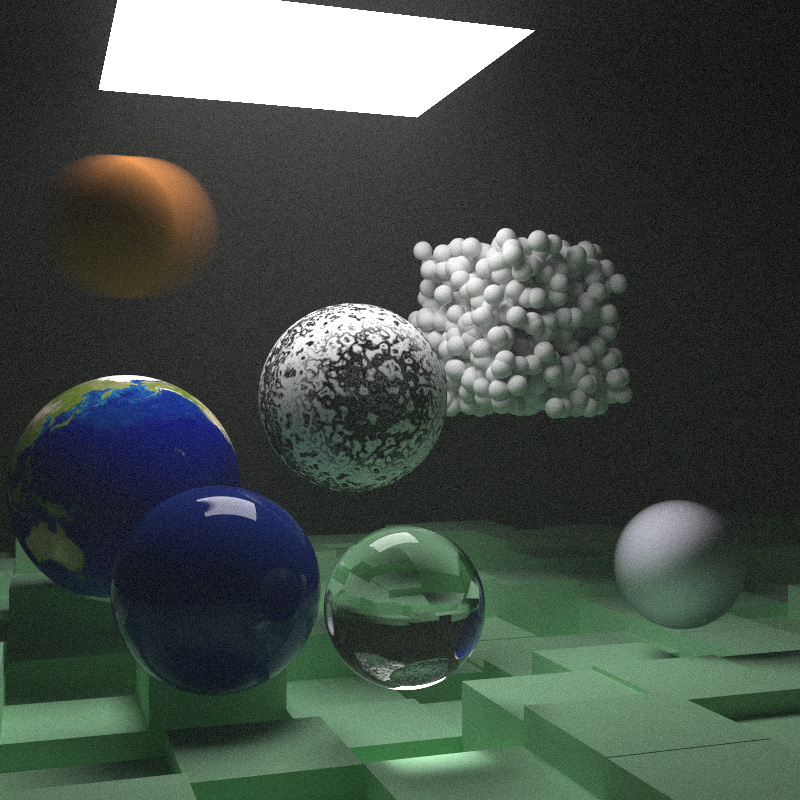
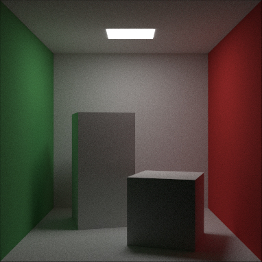

# Ray Tracing: The Next Week With Rust

本项目为一个简单的光线追踪渲染器，参考[_Ray Tracing: The Next Week_](https://raytracing.github.io/books/RayTracingTheNextWeek.html)，用Rust实现。该书为[_Ray Tracing in One Weekend_](https://raytracing.github.io/books/RayTracingInOneWeekend.html) 的下一章。实现了动态模糊、图片用作纹理、体积渲染、Perlin Noise、四边形、光源、实例。

This project is a simple ray tracing renderer, reference [_Ray Tracing: The Next Week_](https://raytracing.github.io/books/RayTracingTheNextWeek.html), implement using Rust. The book is the next chapter of [_Ray Tracing in One Weekend_](https://raytracing.github.io/books/RayTracingInOneWeekend.html). Implemented motion blur, images for texture, volume rendering, Perlin Noise, quadrilaterals, lighting, and instances.

|  |  |
| :-----------------------------------------------: | :-------------------------------------------------: |
|                    final_scene                    |                  cornell_box_scene                  |

## 依赖 Dependency

1. Rayon: 用于多线程加速渲染 Used for multi-threaded accelerated rendering.
2. nalgebra: 提供Vec3支持 Provide Vec3 support.
3. tokio、indicatif: 实现进度条 Used to implement a progress bar.

4. image：用于导入图像用作纹理 Used for importing images as textures.

   

## 用法 Usage

` cargo run --release` 运行并等待完成。 Run and wait for completion.

然后打开目录下的`pic.ppm`图片文件即可。Then open the `pic. ppm` image file in the directory.


该图片即为上文的左图，如果需渲染其他项目，可以把`main.rs`第51行

The output picture is the image on the left from the previous context. If you want to render other projects, you can change the line 51 of `main. rs`, 

```rust
let (world, cam) = final_scene(IMAGE_WIDTH, IMAGE_HEIGHT, CAMERA_SAMPLE, RAY_DEPTH);  
```

中的`final_scene`替换为`scene.rs`文件里的其他scene函数，比如`perlin_scene`、`cornell_box_scene`

and make `final_scene` another function in `scene.rs`. Such as `perlin_scene`、`cornell_box_scene`

## License

The project is released under MIT License.

